# Tinnitus Suite — System Flowchart

Generated: 2026-03-05

```mermaid
flowchart TD
    A([App Start]) --> B[User Profile Select\nlocalStorage multi-user]
    B --> C{Returning user\nwith saved data?}
    C -->|Yes| D[Load saved audiogram\n+ tinnitus frequency]
    C -->|No| E[Welcome Screen\nCalibration prompt]
    D --> DASH[Dashboard\nShow history + jump options]
    E --> CAL

    subgraph CAL["① Calibration (Volume Reference)"]
        direction TB
        CAL1[Play 1 kHz tone at\ncalibration level 60 dBHL] --> CAL2[User confirms\naudio is audible]
    end

    subgraph AUD["② Audiogram — Hearing Test"]
        direction TB
        A1[Select test mode\nQuick 9f / Standard 12f / Fine 16f] --> A2[Test LEFT ear then RIGHT ear]
        A2 --> A3[For each frequency\n250 Hz – 16 kHz]
        A3 --> A4[Hughson-Westlake protocol\nStart at 40 dBHL]
        A4 --> A5{Heard?}
        A5 -->|No| A6[+5 dB]
        A6 --> A5
        A5 -->|Yes| A7[-10 dB]
        A7 --> A8{Heard again?}
        A8 -->|Yes| A9[Record threshold]
        A8 -->|No| A6
        A9 --> A10{More frequencies?}
        A10 -->|Yes| A3
        A10 -->|No| A11[Save audiogram\nto localStorage]
    end

    subgraph TONE["③ Tinnitus Tone Finder"]
        direction TB
        T1[Start near worst audiogram\nfrequency or default] --> T2[Render log-scale slider\n200 Hz – 20 kHz]
        T2 --> T3{NIHL notch detected?\n4 or 6 kHz notch ≥ 15 dB}
        T3 -->|Yes| T4[Show warning + suggest\n1 octave above notch]
        T3 -->|No| T5[Show slope recommendation\nif steep HF loss → pink]
        T4 --> T6
        T5 --> T6[Play oscillator\nSine/Square/Triangle/Sawtooth]
        T6 --> T7[User tunes frequency\n±semitone / ±10¢ / ±1¢]
        T7 --> T8{Fuses with tinnitus?}
        T8 -->|No| T7
        T8 -->|Yes| T9[User clicks MATCHED\nSave frequency]
    end

    subgraph OCT["④ Octave Verification"]
        direction TB
        O1[Present matched freq\n+ octave up / octave down] --> O2[User compares\n3 candidates]
        O2 --> O3[Confirm correct octave\nSave final tinnitus frequency]
    end

    subgraph THERAPY["⑤ Noise Therapy (TMNMT)"]
        direction TB
        TH1[Pre-generate 30 s stereo\nnoise buffers in background] --> TH2[Select noise type\nNotched / White / Pink / Brown]
        TH2 --> TH3[buildGraph: assemble\nWeb Audio signal chain]
        TH3 --> TH4{Noise type}
        TH4 -->|notched| TH5[3-stage ERB notch\nbiquad cascade]
        TH4 -->|white/pink/brown| TH6[Direct to audiogram EQ]
        TH5 --> TH7{Has audiogram?}
        TH6 --> TH7
        TH7 -->|Yes| TH8[Peaking EQ at each\naudiogram frequency\ngain = threshold × 0.5 capped +18 dB]
        TH7 -->|No| TH9[No EQ applied]
        TH8 --> TH10[GainNode → Analyser\n→ AudioContext.destination]
        TH9 --> TH10
        TH10 --> TH11[Real-time spectrum canvas\nlog-scale visualiser]
        TH11 --> TH12{Session timer\nSleep timer?}
        TH12 -->|Sleep timer fires| TH13[Fade out + stop\nSave session log]
        TH12 -->|User stops| TH13
    end

    CAL --> AUD
    AUD --> TONE
    TONE --> OCT
    OCT --> THERAPY
    DASH --> THERAPY
```

## Stage Summary

| Stage | Component | Key Detail |
|---|---|---|
| ① Calibration | Volume reference | 1 kHz at 60 dBHL |
| ② Audiogram | Hearing thresholds | Hughson-Westlake, 9–16 frequencies, 250 Hz–16 kHz |
| ③ Tone Finder | Tinnitus frequency match | Log-scale slider, NIHL notch detection |
| ④ Octave Verify | Prevents ½/2× error | Compare matched ± 1 octave |
| ⑤ Therapy | TMNMT notched noise | 3-stage ERB biquad notch + audiogram EQ |

## Noise Algorithm Summary

| Type | Method | Spectrum slope |
|---|---|---|
| White | `Math.random() * 2 - 1` | 0 dB/oct (flat) |
| Pink | 7-stage Voss-McCartney IIR | −3 dB/oct |
| Brown | Single-pole leaky integrator | −6 dB/oct |
| Notched White | White → 3-stage ERB biquad notch cascade | Flat with notch at tinnitus freq |

## Notch Shape Parameters

- **Width**: 1.5 × ERB(f) in octaves, where ERB(f) = 24.7 × (4.37f/1000 + 1) [Glasberg & Moore 1990]
- **Stage 1**: Q = f/(highEdge − lowEdge), depth = −nd dB (tight deep notch)
- **Stage 2**: Q × 0.65, depth = −0.5·nd dB (broader skirts)
- **Stage 3**: freq × 0.955, Q × 1.4, depth = −0.3·nd dB (low-side asymmetry correction)
